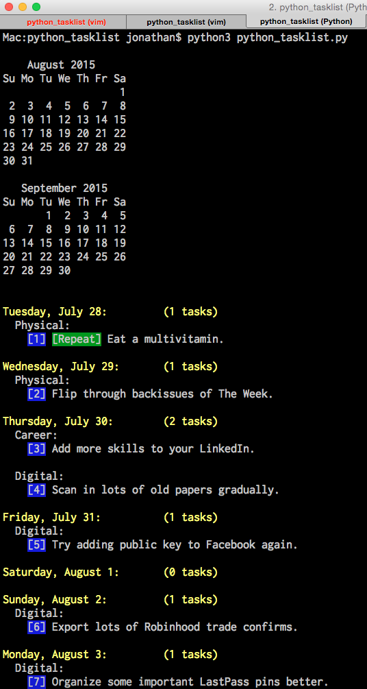

# Python Tasklist Manager

A personal command-line tasklist / todos manager:
- Some Vim-style commands.
- Demo JSON data is included in demo_data.txt.
- Project is a work in progress.
  
## Commands:
- New task format is: "n Task body; Category; Date"
  - "n Do the laundry; Physical; t" adds the task with the category tag 'Physical' on today. 
  - "n Do the laundry; Physical; 10" adds the task to the next upcoming 10th. 
  - So if today is August 5, the task will be set on August 10. If today is August 15, the task will be set on September 10.
- Move task format is: "TaskNum\mDate"
  - "1m10" moves the task labeled #1 to the next upcoming 10th.
  - So if today is August 5, the task will move to August 10. If today is August 15, the task will move to September 10.
  - "1mt" moves task labeled #1 to 'today'.
- Delete task format is: "TaskNum\d"
  - "1d" deletes the task labeled #1.
- Save / quit commands are w/q/wq.
  

